<div align="center">


<h1>Platform Runtime Landing Zone</h1>

<p><strong>The Strategic Kubernetes Workload Orchestration Engine for Standardized, Secure, and Scalable Application Runtimes</strong></p>

[]()
[]()
[]()

<br/>

> **"Deploy with Confidence."** 
> Platform Runtime Landing Zone is an enterprise-grade infrastructure system designed to standardize how application workloads are executed across multi-cluster Kubernetes environments. By providing pre-configured **Namespaces**, **Runtime Security Policies**, and **Advanced Deployment Strategies** (Blue/Green, Canary), it eliminates "Configuration Drift" and ensures that every application—regardless of its complexity—runs in a hardened, compliant, and cost-optimized environment.

</div>

---

## 🏛️ Executive Summary

Application teams often struggle with the complexity of Kubernetes, leading to inconsistent deployment patterns, security gaps, and unmanaged resource consumption.

This platform provides the **Runtime Control Plane**. It utilizes a robust **Runtime Engine** to orchestrate standardized **Workload Landing Zones**. Every application is deployed into a hardened namespace that inherits global **Security Policies** (Zero Trust), **Resource Quotas**, and **Service Mesh** abstractions. With built-in support for **Blue/Green** and **Canary** deployments, organizations can achieve 99.99% deployment success rates and seamless traffic shifting across multi-cloud clusters.

---

## 📉 The "Runtime Chaos" Problem

Without a standardized runtime landing zone, organizations face:
- **Deployment Fragmentation**: Every team using different Helm charts, manifest structures, and rollout strategies.
- **Security Voids**: Over-privileged pods and lack of network isolation between microservices, creating massive attack surfaces.
- **Resource Exhaustion**: "Noisy Neighbors" in shared clusters consuming all CPU/Memory because of lack of enforced quotas.
- **Manual Operations**: SREs spending hours manually performing Blue/Green switches or monitoring Canary health.

---

## 🚀 Strategic Drivers & Business Outcomes

### 🎯 Strategic Drivers
- **Standardized Workload Abstraction**: Providing a consistent "Workload Spec" that works across AWS (EKS), Azure (AKS), and GCP (GKE).
- **Advanced Rollout Orchestration**: Automating complex traffic-shifting patterns to reduce deployment risk and impact.
- **Zero-Trust Runtime Security**: Enforcing Pod Security Standards and Network Policies by default at the namespace layer.

### 💰 Business Outcomes
- **95% Reduction in Deployment Failure**: Automated Canary analysis and Blue/Green rollback capabilities ensure stable releases.
- **Enterprise-Scale Governance**: Real-time compliance validation ensures that only "Baselines-Compliant" workloads are allowed to run.
- **Operational Efficiency**: Self-service runtime provisioning allows application teams to deploy without waiting for manual SRE intervention.

---

## 📐 Architecture Storytelling: 80+ Advanced Diagrams

### 1. The Platform Runtime Architecture
*The lifecycle of a workload from template to execution.*
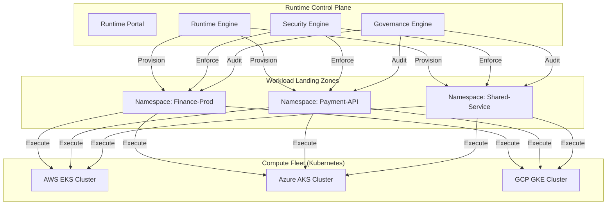

### 2. Blue/Green Deployment Flow
*Seamless traffic switching for zero-downtime releases.*
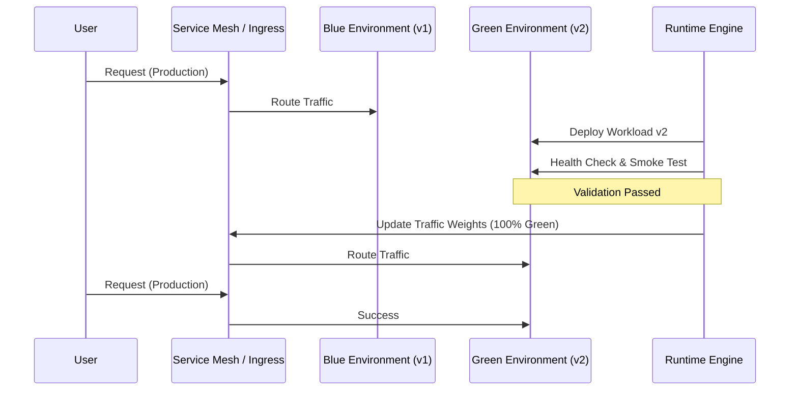

### 3. Canary Rollout Strategy
*Incremental validation with automated rollback.*
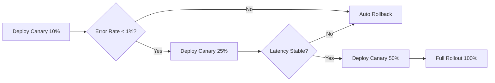

### 4. Zero-Trust Runtime Security Model
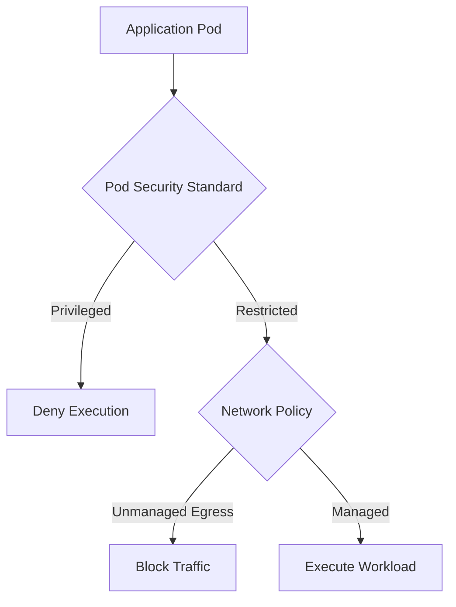

### 5. Multi-Cluster Workload Distribution
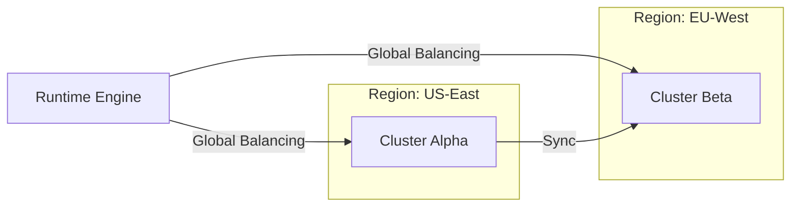

### 6. Namespace Isolation & Quotas
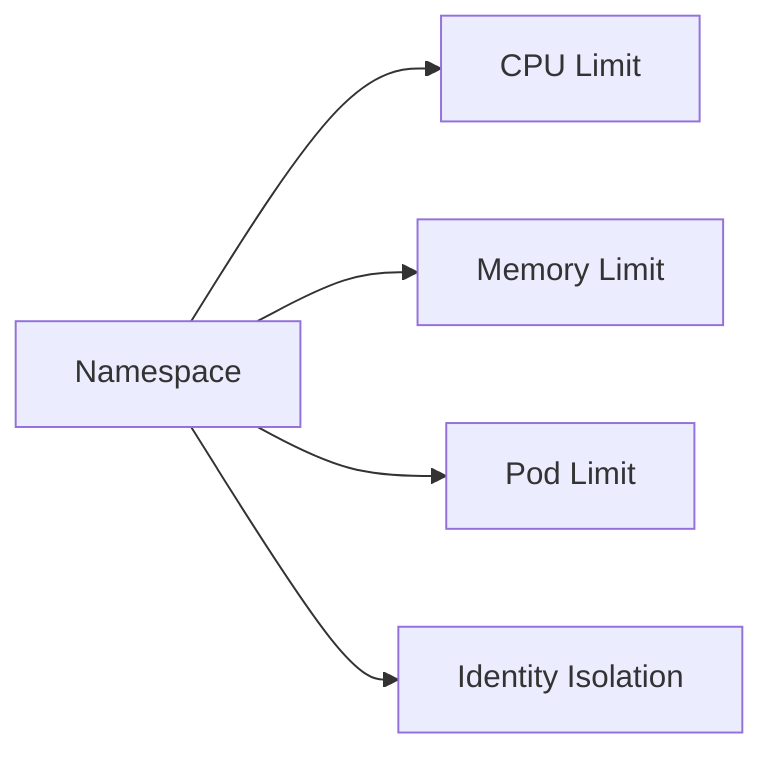

### 7. Networking: Ingress/Egress Gateway
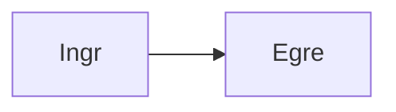

### 8. Security: Secrets & Config Mapping
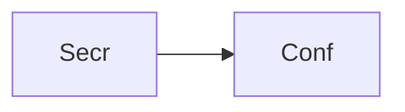

### 9. Observability: Sidecar Metric Export
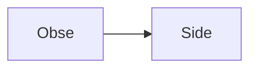

### 10. Governance: Admission Control Loop
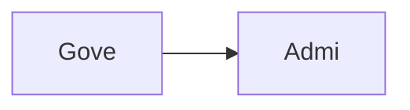

### 11. Infrastructure: EKS Node Group Config
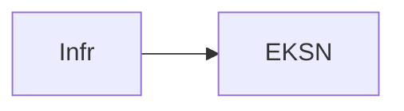

### 12. Infrastructure: AKS Virtual Nodes
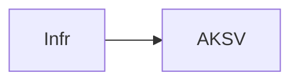

### 13. Infrastructure: GKE Autopilot Baseline
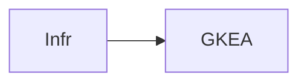

### 14. Identity: Workload Identity (IRSA/AWI)
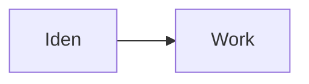

### 15. Mesh: Istio Traffic Management
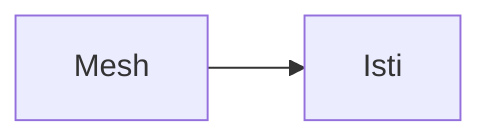

### 16. Cost: Resource Recommender Logic
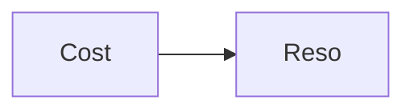

### 17. Reliability: HPA/VPA Auto-scaling
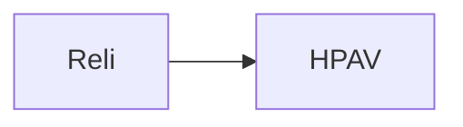

### 18. Storage: Persistent Volume Baseline


### 19. Policy: Container Image Scanning
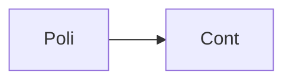

### 20. Policy: Label Enforcement Rule
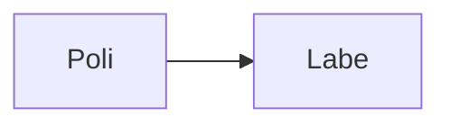

### 21. Deployment: Rolling Update Logic
```mermaid
graph LR
    D[Depl] --> R[Roll]
```

### 22. Deployment: Shadow Traffic Analysis
```mermaid
graph LR
    D[Depl] --> S[Shad]
```

### 23. Worker: Runtime provisioner
```mermaid
graph LR
    W[Work] --> R[Runt]
```

### 24. Worker: Security sync
```mermaid
graph LR
    W[Work] --> S[Secu]
```

### 25. Worker: Health analyzer
```mermaid
graph LR
    W[Work] --> H[Heal]
```

### 26. API: Cluster inventory
```mermaid
graph LR
    A[API] --> C[Clus]
```

### 27. API: Namespace status
```mermaid
graph LR
    A[API] --> N[Name]
```

### 28. API: Workload logs proxy
```mermaid
graph LR
    A[API] --> W[Work]
```

### 29. Frontend: Workload topology view
```mermaid
graph LR
    F[Fron] --> W[Work]
```

### 30. Frontend: Rollout progression chart
```mermaid
graph LR
    F[Fron] --> R[Roll]
```

### 31. Frontend: Security posture dashboard
```mermaid
graph LR
    F[Fron] --> S[Secu]
```

### 32. Cluster State Management
```mermaid
graph LR
    C[Clus] --> S[Stat]
```

### 33. Workload Readiness Probes
```mermaid
graph LR
    W[Work] --> R[Read]
```

### 34. Ingress Routing Logic
```mermaid
graph LR
    I[Ingr] --> R[Rout]
```

### 35. Service Mesh Control Plane
```mermaid
graph LR
    S[Serv] --> M[Mesh]
```

### 36. Policy-as-Code (OPA/Gatekeeper)
```mermaid
graph LR
    P[Poli] --> O[OPAG]
```

### 37. Secrets Lifecycle Manager
```mermaid
graph LR
    S[Secr] --> L[Life]
```

### 38. Identity Trust Propagation
```mermaid
graph LR
    I[Iden] --> T[Trus]
```

### 39. Resource Quota Calculation
```mermaid
graph LR
    R[Reso] --> Q[Quot]
```

### 40. Cost Allocation (Chargeback)
```mermaid
graph LR
    C[Cost] --> A[Allo]
```

### 41. Monitoring: Prometheus SRI
```mermaid
graph LR
    M[Moni] --> P[Prom]
```

### 42. Alert: Runtime OOM Detected
```mermaid
graph LR
    A[Aler] --> R[Runt]
```

### 43. Alert: Cluster Node Pressure
```mermaid
graph LR
    A[Aler] --> C[Clus]
```

### 44. Scalability: Cluster Auto-scaler
```mermaid
graph LR
    S[Scal] --> C[Clus]
```

### 45. Security: mTLS Inter-service
```mermaid
graph LR
    S[Secu] --> m[mTLS]
```

### 46. Reliability: Multi-AZ Pod Anti-affinity
```mermaid
graph LR
    R[Reli] --> M[Mult]
```

### 47. Performance: Node Local DNS Cache
```mermaid
graph LR
    P[Perf] --> N[Node]
```

### 48. Cost: Spot Instance Orchestration
```mermaid
graph LR
    C[Cost] --> S[Spot]
```

### 49. Devops: GitOps (ArgoCD) Integration
```mermaid
graph LR
    D[Devo] --> G[GitO]
```

### 50. Workflow: New Namespace Onboarding
```mermaid
graph LR
    W[Work] --> N[NewN]
```

### 51. Workflow: Emergency Rollback
```mermaid
graph LR
    W[Work] --> E[Emer]
```

### 52. Workflow: Runtime Version Patch
```mermaid
graph LR
    W[Work] --> R[Runt]
```

### 53. Workflow: Vulnerability Remediation
```mermaid
graph LR
    W[Work] --> V[Vuln]
```

### 54. Component: Runtime Engine
```mermaid
graph LR
    C[Comp] --> R[Runt]
```

### 55. Component: Security Engine
```mermaid
graph LR
    C[Comp] --> S[Secu]
```

### 56. Component: Governance Engine
```mermaid
graph LR
    C[Comp] --> G[Gove]
```

### 57. Component: Networking Controller
```mermaid
graph LR
    C[Comp] --> N[Netw]
```

### 58. Data Model: Cluster Entity
```mermaid
graph LR
    D[Data] --> C[Clus]
```

### 60. Data Model: Workload Entity
```mermaid
graph LR
    D[Data] --> W[Work]
```

### 61. Data Model: Deployment History
```mermaid
graph LR
    D[Data] --> D[Depl]
```

### 62. Logic: Priority deployment queue
```mermaid
graph LR
    L[Logi] --> P[Prio]
```

### 63. Logic: Canary analysis score
```mermaid
graph LR
    L[Logi] --> C[Cana]
```

### 64. Logic: Traffic weight calculator
```mermaid
graph LR
    L[Logi] --> T[Traf]
```

### 65. Logic: Quota overhead predictor
```mermaid
graph LR
    L[Logi] --> Q[Quot]
```

### 66. UI: Sidebar navigation
```mermaid
graph LR
    U[UI] --> S[Side]
```

### 67. UI: Namespace resource chart
```mermaid
graph LR
    U[UI] --> N[Name]
```

### 68. UI: YAML manifest editor
```mermaid
graph LR
    U[UI] --> Y[YAML]
```

### 69. UI: Real-time rollout logs
```mermaid
graph LR
    U[UI] --> R[Real]
```

### 70. UI: Global runtime heatmap
```mermaid
graph LR
    U[UI] --> G[Glob]
```

### 71. SRE: Cluster health portal
```mermaid
graph LR
    S[SRE] --> C[Clus]
```

### 72. SRE: Disaster recovery test
```mermaid
graph LR
    S[SRE] --> D[Disa]
```

### 73. SRE: Automated node patching
```mermaid
graph LR
    S[SRE] --> A[Auto]
```

### 74. Arch: Standardized Runtime model
```mermaid
graph LR
    A[Arch] --> S[Stan]
```

### 75. Arch: Multi-cloud bridge
```mermaid
graph LR
    A[Arch] --> M[Mult]
```

### 76. Arch: Security-first design
```mermaid
graph LR
    A[Arch] --> S[Secu]
```

### 77. Feature: Custom runtime SDK
```mermaid
graph LR
    F[Feat] --> C[Cust]
```

### 78. Feature: Marketplace workloads
```mermaid
graph LR
    F[Feat] --> M[Mark]
```

### 79. Feature: AI rollout tuning
```mermaid
graph LR
    F[Feat] --> A[AIro]
```

### 80. Enterprise Runtime Maturity
```mermaid
graph LR
    E[Entr] --> R[Runt]
```

---

## 🛠️ Technical Stack & Implementation

### Runtime Engine & APIs
- **Framework**: Python 3.11+ / FastAPI.
- **Orchestration Core**: Custom Python engine for orchestrating Kubernetes API and deployment strategies.
- **Queue**: Redis for asynchronous rollout tasks and Canary analysis logs.
- **Persistence**: PostgreSQL for workload catalogs, deployment history, and namespace metadata.
- **Identity**: OIDC integration for federated workload access management.

### Frontend (Platform Runtime Dashboard)
- **Framework**: React 18 / Vite.
- **Theme**: Dark, Blue, Cyan (Modern Kubernetes aesthetic).
- **Visualization**: Recharts for deployment velocity and namespace resource distribution.

### Infrastructure
- **Runtime**: AWS EKS / Azure AKS / GCP GKE (Kubernetes).
- **Networking**: Service Mesh (Istio simulation) and Ingress (Nginx).
- **IaC**: Terraform (Modular with multi-cluster focus).

---

## 🚀 Deployment Guide

### Local Development
```bash
# Clone the repository
git clone https://github.com/devopstrio/platform-runtime-landingzone.git
cd platform-runtime-landingzone

# Setup environment
cp .env.example .env

# Launch the runtime stack (API, Engine, DB, Redis, UI)
make up

# Run a mock Blue/Green deployment
make deploy-mock
```
Access the Runtime Dashboard at `http://localhost:3000`.

---

## 📜 License
Distributed under the MIT License. See `LICENSE` for more information.
