<div align="center">


<h1>Platform Runtime Landing Zone</h1>

<p><strong>The Strategic Kubernetes Workload Orchestration Engine for Standardized, Secure, and Scalable Application Runtimes.</strong></p>

[]()
[]()
[]()

<br/>

> **"Deploy with Confidence."** 
> **Platform Runtime Landing Zone** is an enterprise-grade infrastructure system designed to standardize how application workloads are executed across multi-cluster environments. It provides pre-configured namespaces, runtime security policies, and advanced deployment strategies (Canary/Blue-Green) to ensure every application runs in a hardened, compliant environment.

</div>

---

## 🏛️ Executive Summary

Application teams often struggle with the complexity of Kubernetes, leading to inconsistent deployment patterns, security gaps, and unmanaged resource consumption. Organizations often fail to scale their container platforms because they lack a standardized "Runtime Landing Zone," creating significant operational friction and technical debt.

This platform provides the **Runtime Control Plane**. It implements a complete **Workload Orchestration Framework**, enabling Platform Engineers to manage application runtimes as a first-class citizen. By automating the provisioning of hardened namespaces and orchestrating advanced traffic-shifting strategies, we ensure that every application—from monoliths to microservices—runs in an environment that is secure by default, audited for history, and optimized for performance.

---

## 📐 Architecture Storytelling: Principal Reference Models

### 1. Principal Architecture: Global Platform Runtime Control Plane & Multi-Tenant Orchestration
This diagram illustrates the end-to-end flow from workload onboarding and namespace provisioning to GitOps reconciliation, multi-cluster distribution, and institutional runtime auditing.

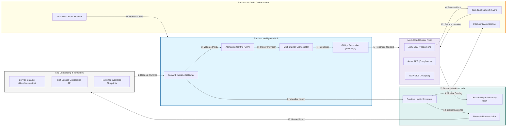

### 2. The Runtime Lifecycle Management Flow
The continuous path of an application workload from initial cluster bootstrapping and provisioning to active scaling and forensic auditing.

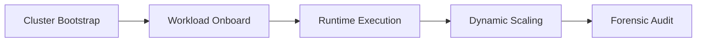

### 3. Multi-Tenant Isolation Architecture
Hardened separation of organizational units within shared clusters using Namespaces, Hierarchical RBAC, and strict Network Policies.

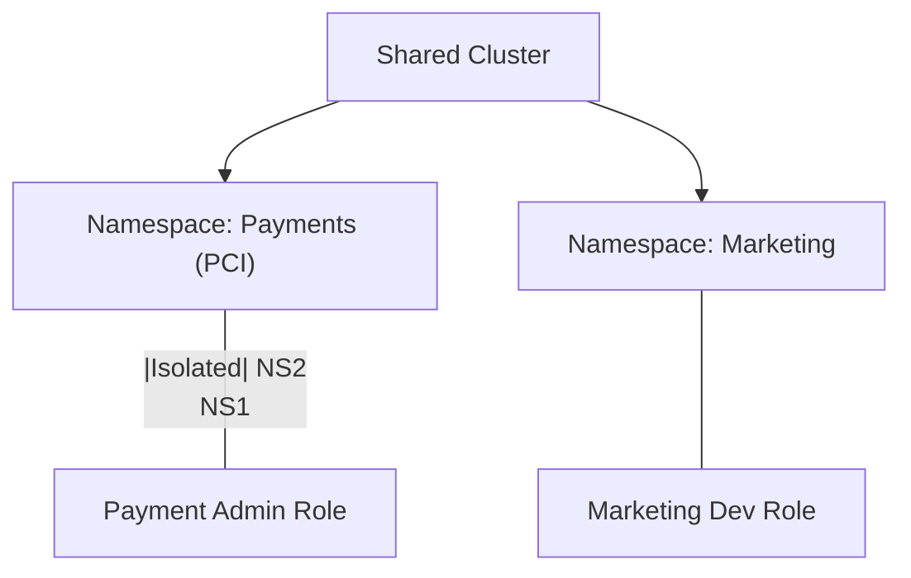

### 4. Shared Services Ingress/Egress Hub
Centralizing ingress (Public/Private Load Balancers) and egress traffic (API Gateways/Proxies) to ensure consistent security and performance across all pods.

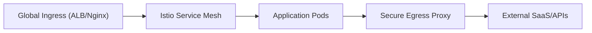

### 5. GitOps & Continuous Delivery Flow
Automated reconciliation of cluster state with Git repositories using Flux or ArgoCD to ensure that production environments never drift from their intended configuration.

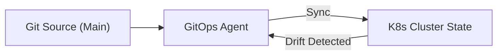

### 6. Observability & Telemetry Mesh
Providing high-fidelity visibility into cluster health and application performance through centralized logging (EFK), metrics (Prometheus), and tracing (Otel).

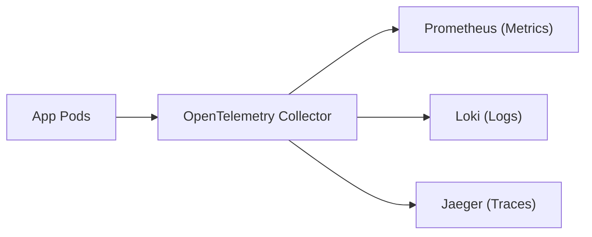

### 7. Institutional Runtime Scorecard
Grading organizational clusters on key performance indicators: Security Posture, Resource Utilization Efficiency, and Deployment Success Rate.

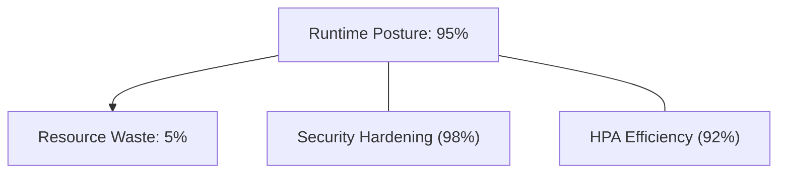

### 8. Identity & RBAC for Platform Ops
Managing fine-grained access to cluster resources and platform services between platform engineers, app developers, and security auditors.

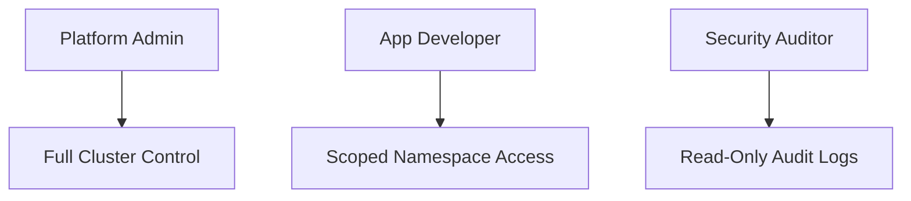

### 9. Runtime Security & Hardening (Zero Trust)
Enforcing Pod Security Standards and real-time threat detection (Falco/Sysdig) to block malicious activity within the container runtime.

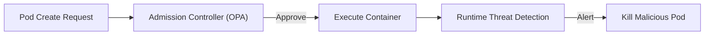

### 10. IaC Deployment: LandingZone-as-Code Framework
Using Terraform to deploy and manage the versioned distribution of the multi-cluster infrastructure, platform services, and network fabric.

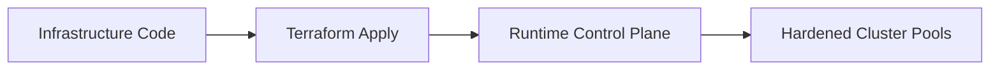

### 11. Metadata Lake for Forensic Runtime Audit
Storing long-term records of every deployment, scaling event, and administrative access for institutional investigation and compliance.

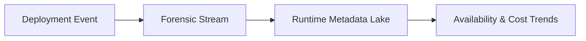

---

## 🏛️ Core Runtime Pillars

1.  **Standardized Workload Abstraction**: Consistent "Workload Specs" that operate identically across AWS, Azure, and GCP.
2.  **Multi-Tenant Isolation**: Hardened separation of teams and applications using advanced K8s primitives.
3.  **Zero-Trust Networking**: Enforcing mTLS and granular network policies by default at the service mesh layer.
4.  **GitOps-Driven Configuration**: Ensuring that production state is always synchronized with versioned Git sources.
5.  **Automated Scaling & Healing**: Leveraging HPA, VPA, and node auto-scalers (Karpenter) for maximum efficiency.
6.  **Full Observability**: Integrated telemetry mesh providing deep visibility into every container interaction.

---

## 🛠️ Technical Stack & Implementation

### Runtime Engine & APIs
*   **Framework**: Python 3.11+ / FastAPI.
*   **Orchestration**: Custom engine for managing multi-cluster life-cycles and GitOps synchronization.
*   **Admission Hub**: Policy-as-Code enforcement (OPA/Gatekeeper) for validating workload configurations.
*   **Mesh Integration**: Service Mesh (Istio) orchestration for traffic management and security.
*   **State Management**: PostgreSQL (Metadata Lake) and Redis (Reconciliation Cache).

### Runtime Dashboard (UI)
*   **Framework**: React 18 / Vite.
*   **Theme**: Dark, Blue, Cyan (Modern Kubernetes aesthetic).
*   **Visualization**: Recharts for cluster health metrics, deployment velocity, and resource distribution.

### Infrastructure & DevOps
*   **Runtime**: AWS EKS / Azure AKS / GCP GKE.
*   **Networking**: Cilium/Calico for CNI and Istio for Service Mesh.
*   **IaC**: Modular Terraform for deploying the runtime hub and cluster distributions.

---

## 🏗️ IaC Mapping (Module Structure)

| Module | Purpose | Real Services |
| :--- | :--- | :--- |
| **`infrastructure/runtime_hub`** | Central management plane | EKS, PostgreSQL, Redis |
| **`infrastructure/clusters`** | Hardened cluster distributions | EKS, AKS, GKE |
| **`infrastructure/networking`** | CNI and Service Mesh fabric | Cilium, Istio, Nginx |
| **`infrastructure/auditing`** | Forensic runtime sinks | S3, Athena, Quicksight |

---

## 🚀 Deployment Guide

### Local Principal Environment
```bash
# Clone the runtime platform
git clone https://github.com/devopstrio/platform-runtime-landingzone.git
cd platform-runtime-landingzone

# Configure environment
cp .env.example .env

# Launch the Runtime stack
make up

# Run a mock Blue/Green deployment simulation
make deploy-mock
```

Access the Runtime Dashboard at `http://localhost:3000`.

---

## 📜 License
Distributed under the MIT License. See `LICENSE` for more information.

---
<div align="center">
  <p>© 2026 Devopstrio. All rights reserved.</p>
</div>
